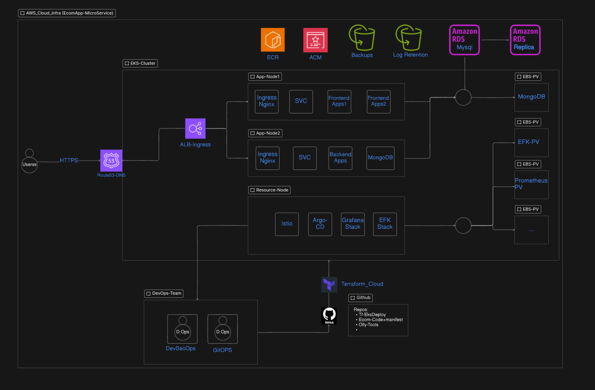

# AWS Architecture

This repository contains a collection of custom-designed and detailed **AWS** architecture blueprints for various applications and use cases. Each architecture is implemented with best practices in scalability, security, and availability in mind. Whether you're building basic infrastructure, deploying microservices with EKS, or designing a real-time chat platform, you'll find structured and reusable templates here.

## AWS Basic Infrastructure
Basic AWS architecture with EC2, RDS, S3, and CloudFlare CDN

## VPC Custom CIDR Range
AWS VPC and subnet configuration with CIDR blocks

## AWS E-commerce Infrastructure
AWS infrastructure for an e-commerce application with EKS

## AWS Chat Application
AWS infrastructure for a chat application with EKS and monitoring

## Chat Application with EKS
Chat application architecture with EKS, MongoDB Atlas, and Jenkins CI/CD

