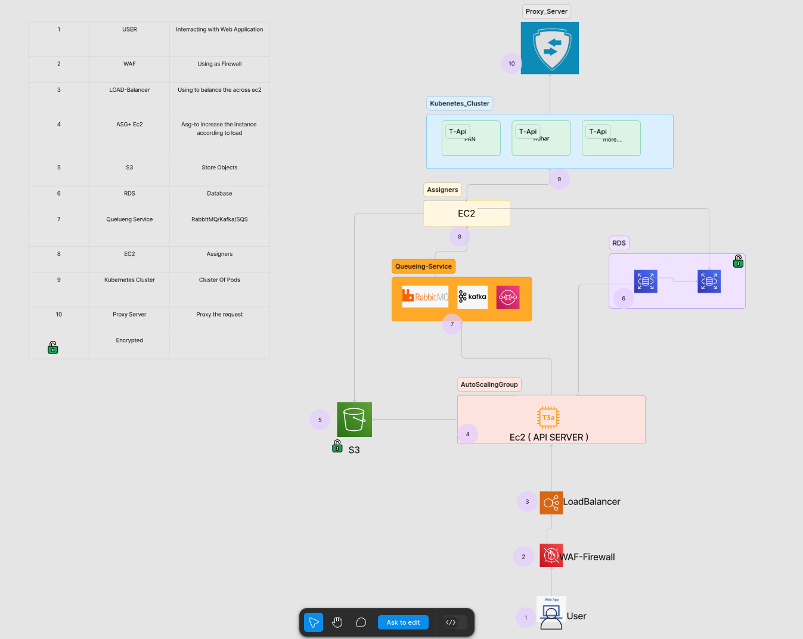

# 🧩 Microservices Architecture

This repository contains a custom-designed and detailed **Microservices Architecture** diagram that I created, illustrating the structure and flow of a modern web application using cloud-native components and microservices principles.

## 🔢 Numbered Components

Each component in the architecture is clearly numbered and described below:

1. **USER** – Interacting with the web application.  
2. **WAF (Web Application Firewall)** – Protecting the system from malicious access.  
3. **Load Balancer** – Distributing traffic across EC2 instances.  
4. **ASG + EC2 (API SERVER)** – Auto Scaling Group dynamically manages EC2 instances based on traffic.  
5. **S3** – Object storage for static files, media, and other assets.  
6. **RDS** – Managed relational database service.  
7. **Queueing Service (RabbitMQ / Kafka / SQS)** – Manages asynchronous task processing and communication between services.  
8. **EC2 (Assigners)** – Dedicated instances handling specific backend logic or assignments.  
9. **Kubernetes Cluster** – Orchestrates containerized services, represented here as multiple T-API pods.  
10. **Proxy Server** – For secure request routing and load handling.

🔒 **Encryption** is applied where needed to ensure data security and compliance.

## 🧰 Technologies Used

- AWS Services: EC2, S3, RDS, ASG, WAF
- Kubernetes for container orchestration
- RabbitMQ / Kafka / AWS SQS for message brokering
- Load Balancing and Proxying
- Modern API-first microservices design

📌 *This architecture was fully created and designed by me to demonstrate a scalable and secure microservices-based infrastructure.*

